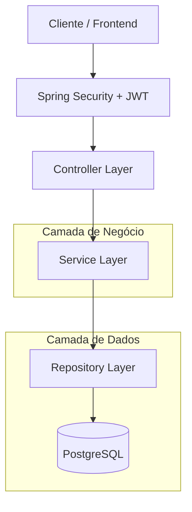
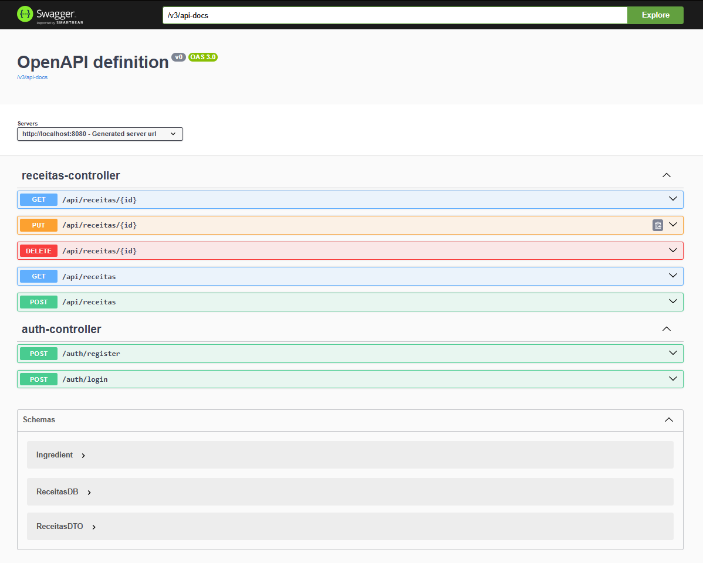

# 📖 Livro de Receitas API

[](https://github.com/betolara1/LivrodeReceitas-JavaSpringBoot/actions/workflows/ci.yml)

Uma API robusta para gerenciamento de receitas culinárias, desenvolvida com **Java Spring Boot**, oferecendo segurança, persistência em PostgreSQL e documentação automatizada.

---

## 🎯 Objetivo & Problema

### O Problema
Organizar receitas costuma ser uma tarefa fragmentada. Muitas vezes as pessoas guardam receitas em diferentes lugares, sem uma maneira fácil de acessá-las ou mantê-las privadas. Além disso, falta uma interface padronizada para integrações futuras ou acesso programático.

### O Objetivo
Prover uma plataforma centralizada e segura onde usuários podem:
- Cadastrar e gerenciar suas próprias receitas.
- Garantir que apenas o dono da receita possa editá-la ou excluí-la.
- Ter acesso rápido a uma documentação clara via Swagger.
- Facilitar o deploy e desenvolvimento através de containerização (Docker).

---

## 🏗️ Arquitetura do Sistema

O projeto segue a arquitetura multicamadas padrão do Spring Boot, com foco em segurança perimetral via JWT.



---

## 🚀 Como Rodar o Projeto

### Pré-requisitos
- Docker & Docker Compose (Recomendado)
- JDK 17+ (para rodar localmente)
- Maven 3.8+ (ou utilize o `./mvnw` incluso)

### 🐳 Via Docker (Mais Fácil)
1. Certifique-se de que o Docker está rodando.
2. Na raiz do projeto, execute:
   ```bash
   docker-compose up --build
   ```
3. A API estará disponível em `http://localhost:8080`.

### 💻 Desenvolvimento Local
1. Suba o banco de dados (você pode usar apenas o serviço `db` do docker-compose).
2. Configure as credenciais no `src/main/resources/application.properties`.
3. Execute o comando:
   ```bash
   ./mvnw spring-boot:run
   ```

---

## 📝 Exemplos de Request/Response

### 1. Criar Receita (`POST /api/receitas`)
**Request:**
```json
{
  "title": "Bolo de Cenoura",
  "description": "Bolo fofinho com cobertura de chocolate",
  "ingredients": "Cenoura, ovos, açúcar, farinha, óleo, chocolate",
  "instructions": "Bata as cenouras no liquidificador..."
}
```
**Response (201 Created):**
```json
{
  "id": 1,
  "title": "Bolo de Cenoura",
  "description": "Bolo fofinho com cobertura de chocolate"
}
```

### 2. Listar Minhas Receitas (`GET /api/receitas`)
**Response (200 OK):**
```json
[
  {
    "id": 1,
    "title": "Bolo de Cenoura",
    "description": "Bolo fofinho com cobertura de chocolate"
  }
]
```

---

## 🔍 Documentação API (Swagger)

A API conta com documentação interativa via Swagger/OpenAPI.
Ao rodar o projeto, acesse:
👉 [http://localhost:8080/swagger-ui.html](http://localhost:8080/swagger-ui.html)


---

## 🛠️ Tecnologias & Melhores Práticas

- **Spring Boot 3.x**: Framework base.
- **Spring Security + JWT**: Autenticação e autorização robustas.
- **PostgreSQL**: Banco de dados relacional de alta performance.
- **JUnit 5 / Mockito**: Cobertura de testes unitários e de integração.
- **Docker/Docker Compose**: Padronização de ambiente.
- **GitHub Actions**: Pipeline CI configurada para Build, Testes e Lint.

---

## 🧪 Testes Automatizados

Para rodar a bateria de testes:
```bash
./mvnw test
```
O projeto inclui testes de unidade para a camada de serviço e testes de integração para os controladores.
